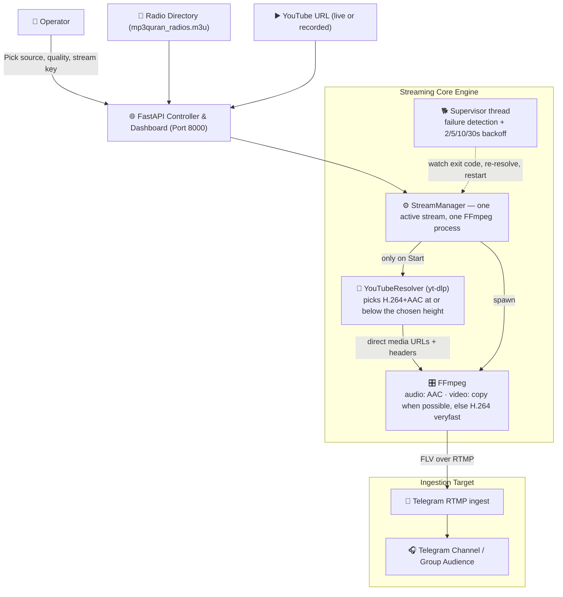

<div align="center">

# 📻 Quran Stream (`quran-stream`)

### Quran Radio + YouTube Live/Video Streaming Controller for Telegram via RTMP

[](https://www.python.org/)
[](https://fastapi.tiangolo.com/)
[](https://ffmpeg.org/)
[](https://github.com/yt-dlp/yt-dlp)
[](https://en.wikipedia.org/wiki/Real-Time_Messaging_Protocol)
[](https://www.docker.com/)
[](https://telegram.org/)
[](LICENSE)

**Multi-Station M3U Parser • YouTube Live & VOD Restreaming • Stream-Copy Optimizer • Telegram RTMP Direct Push • 24/7 Watchdog**

[System Architecture](#-streaming-pipeline-architecture) • [Key Capabilities](#-key-capabilities) • [Docker Deployment](#-docker-deployment) • [Local Setup](#-local-setup)

</div>

---

## 🎯 Overview

**Quran Stream** is a resilient, lightweight broadcast controller that pushes three kinds of source directly into **Telegram Video Chats / Live Streams** (or any RTMP-compatible destination):

| Source | Pipeline | Output |
|---|---|---|
| 🕌 **Quran Radio** | M3U station → FFmpeg | AAC audio → RTMP |
| 🔴 **YouTube Live** | URL → yt-dlp → FFmpeg | H.264 + AAC → RTMP |
| 🎬 **YouTube Video** | URL → yt-dlp → FFmpeg (play once / loop) | H.264 + AAC → RTMP |

Built on an asynchronous **FastAPI** controller and a supervised **FFmpeg** pipeline, it resolves YouTube media URLs with **yt-dlp** on demand, **stream-copies** anything already compatible with Telegram (no transcode, no wasted CPU), and reconnects automatically with a backoff ladder when a source or the RTMP link drops.

---

## 🏗 Streaming Pipeline Architecture



---

## 🌟 Key Capabilities

- 📡 **Universal Station Catalog:** Parses radio directories (`.m3u`) with hundreds of reciters, cached in memory and filtered client-side — typing in the search box costs zero requests.
- ▶️ **YouTube Live & Recorded Video:** Paste a watch / live / `youtu.be` URL; `yt-dlp` resolves the real media streams at start time. Recorded videos are streamed progressively — nothing is downloaded to disk — with **Play once** or **Loop**.
- ⚡ **Stream-Copy Optimizer:** The resolver asks YouTube for H.264 + AAC at or below the selected height, so FFmpeg usually runs `-c:v copy -c:a copy`: near-zero CPU, faster startup, no quality loss. It transcodes only what is genuinely incompatible — or when a source would blow past the bitrate you asked for.
- 🎚 **Bandwidth Profiles:** `Low` 480p ≈ 800 kbps · `Medium` 720p ≈ 1.8 Mbps · `High` 1080p ≈ 3.5 Mbps, so a poor uplink can be matched from the dashboard.
- 🔄 **Autonomous Reconnection:** A supervisor thread watches the FFmpeg exit code, re-resolves expired YouTube URLs, and restarts on a 2s → 5s → 10s → 30s backoff ladder — never two FFmpeg processes at once.
- 🔒 **Key Hygiene:** The stream key is masked in the UI, never returned by `/api/status`, and scrubbed out of every log line and error message.
- 🪶 **Featherweight Dashboard:** One self-contained HTML page (~16 KB, no CDN, no framework) and a 63-byte status poll every 4s while live — 10s when idle, paused when the tab is hidden.
- 🐳 **Turnkey Docker Stack:** FFmpeg, yt-dlp and the Python dependencies in a single command.

---

## 🐳 Docker Deployment

### Prerequisites
- [Docker Engine](https://docs.docker.com/engine/install/) & [Docker Compose](https://docs.docker.com/compose/) v2+

### Quick Start
Clone the repository and launch the containerized streaming service:

```bash
# Clone the repository
git clone https://github.com/3bkader-gpt/quran-stream.git
cd quran-stream

# Build and start container in detached mode
docker compose up -d --build
```

The streaming control panel will be live at:
```text
http://<server-ip>:8000/
```

### Operational Commands
```bash
# Check container status
docker compose ps

# Inspect live streaming logs and FFmpeg output
docker compose logs -f

# Shut down the stream service
docker compose down
```

---

## 💻 Local Setup (without Docker)

### Prerequisites
- **Python 3.10+**
- **FFmpeg** installed and accessible in system `PATH` (verify via `ffmpeg -version`)
- **yt-dlp** — installed from `requirements.txt`; only needed for the YouTube sources

### Installation & Run

```bash
# 1. Prepare virtual environment
python -m venv .venv

# On Linux/macOS:
source .venv/bin/activate
# On Windows:
.venv\Scripts\activate

# 2. Install Python dependencies
pip install -r requirements.txt

# 3. Start the application controller
uvicorn main:app --host 0.0.0.0 --port 8000 --reload
```

Open `http://localhost:8000` to manage your streams.

Run the self-checks with:

```bash
python test_stream.py
```

---

## 🔌 HTTP API

| Method | Endpoint | Purpose |
|---|---|---|
| `GET` | `/api/stations` | Parsed M3U station list |
| `POST` | `/api/start` | Start a stream (payloads below) |
| `POST` | `/api/stop` | Stop the active stream and its FFmpeg process |
| `GET` | `/api/status` | Small JSON status — never contains the stream key |

```jsonc
// Quran radio
{ "source_type": "quran", "url": "https://...", "rtmp_server": "rtmps://...", "key": "..." }

// YouTube Live
{ "source_type": "youtube_live", "url": "https://www.youtube.com/watch?v=...",
  "rtmp_server": "rtmps://...", "key": "...", "quality": "medium" }

// Recorded YouTube video
{ "source_type": "youtube_video", "url": "https://www.youtube.com/watch?v=...",
  "rtmp_server": "rtmps://...", "key": "...", "quality": "medium", "playback": "loop" }
```

`GET /api/status` returns:

```json
{ "running": true, "state": "LIVE", "source_type": "youtube_live", "name": "Example Stream",
  "url": "https://...", "started_at": "2026-01-01T00:00:00+00:00", "uptime_s": 1938,
  "reconnect_attempt": 0, "quality": "medium", "bitrate_kbps": 1800, "connection": "Stable",
  "video": "H.264 720p (copy)", "audio": "AAC (copy)" }
```

States: `OFFLINE → STARTING → LIVE → (RECONNECTING → STARTING)* → STOPPING → OFFLINE`, plus `ERROR`.

---

## 📡 Telegram Streaming Setup

1. In your Telegram Channel or Group, open the **Live Stream** or **Video Chat** menu.
2. Select **Stream With...** to obtain your unique **Server URL** and **Stream Key**.
3. Paste the URL and Stream Key into the dashboard and press **Save**.
4. Pick a tab — **Quran Stations**, **YouTube Live** or **YouTube Video** — and start the stream.

---

## 📄 License

This project is open-source under the [MIT License](LICENSE).
